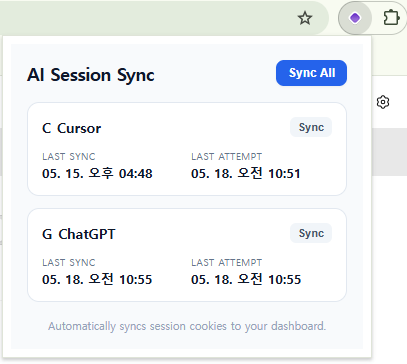
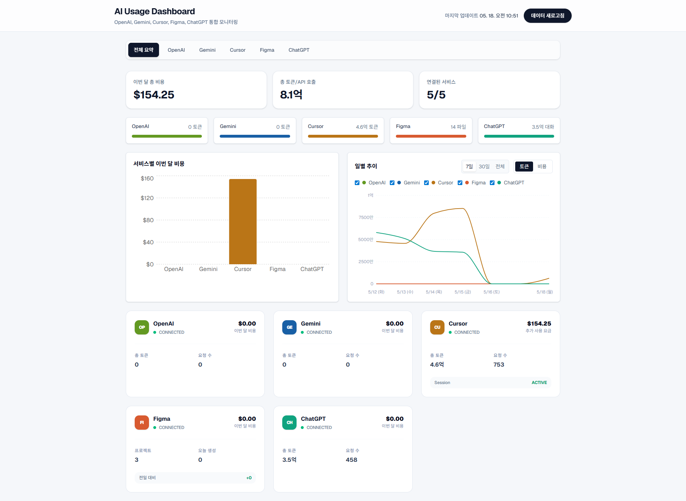
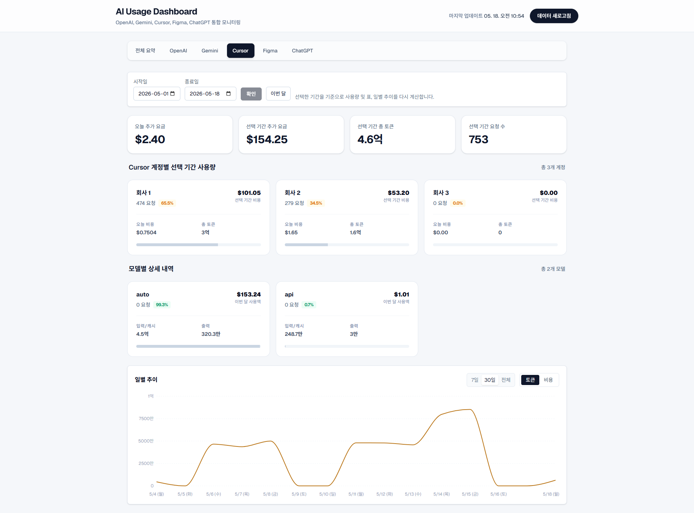
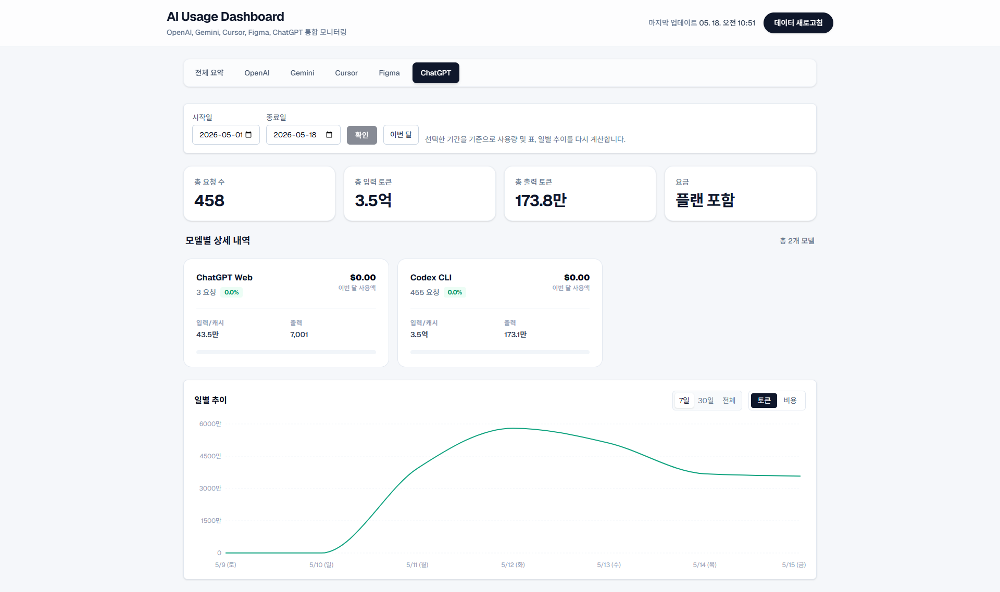
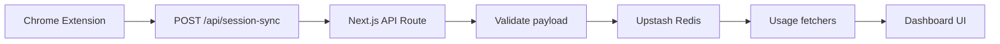
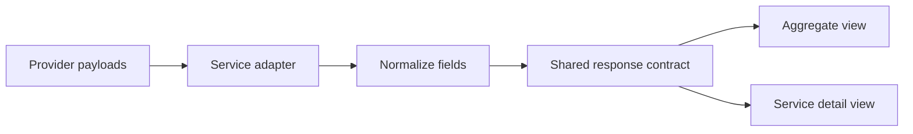
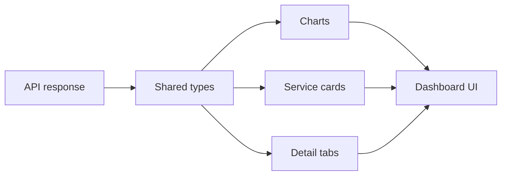
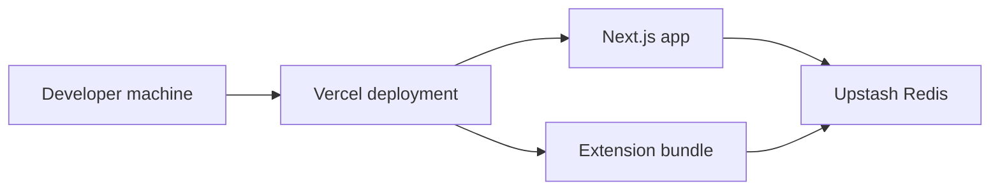
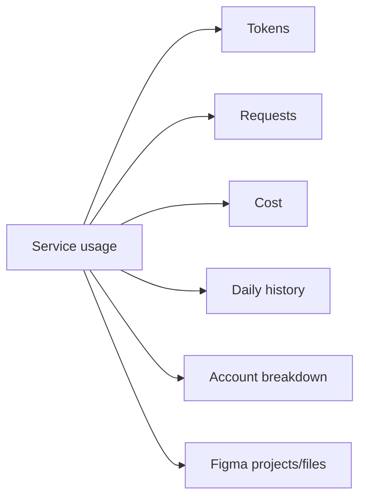

# AI Usage Dashboard

Case study for a Redis-backed AI usage dashboard that aggregates usage and cost data from OpenAI, Gemini, Cursor, ChatGPT Web, and Figma.

This repository is sanitized for public portfolio use. It does not include company source code, private endpoints, or secrets.

## What This Project Does

- Syncs browser-captured session state through a Chrome Extension
- Resolves session data through Redis-first lookup
- Normalizes provider-specific usage payloads into a shared response model
- Renders aggregate and per-service usage, cost, and trend views

## Architecture

```text
Chrome Extension
  -> /api/session-sync
  -> Next.js API
  -> Upstash Redis
  -> Provider fetchers
  -> Dashboard UI
```

## Tech Stack

- Next.js 16
- React 19
- TypeScript
- Tailwind CSS
- Recharts
- Zod
- Upstash Redis
- Vercel
- Chrome Extension
- Plasmo

## Implementation Notes

- `app/api/session-sync/route.ts` receives extension payloads and writes session data to Redis after validation.
- Provider fetchers resolve stored session state before falling back to environment-based configuration.
- The dashboard uses shared types for service status, token counts, request counts, and cost metrics.
- Figma receives a dedicated project/file breakdown view for recent activity.

## Screenshots and Diagrams

Store portfolio visuals in the folders below:

- `public/img/` for captured UI images
- `diagrams/` for Mermaid source files

### Screenshots


*Chrome Extension popup that captures and syncs session state to the server.*


*Main dashboard showing aggregate usage, cost, and trend views across providers.*


*Cursor detail view showing account-level usage and request breakdown.*


*ChatGPT detail view showing provider-specific usage metrics and history.*

### Diagrams

#### Browser capture to Redis sync flow



#### Usage normalization flow



#### Dashboard rendering flow



#### High-level deployment flow



#### Data model overview



### Optional Evidence

- Public demo URL
- Before / after comparison
- API response example

## Folder Layout

```text
public/
  img/
    main-dashboard.png
    extension.png
    cursor.png
    chatgpt.png

diagrams/
  browser-to-redis.mmd
  usage-normalization.mmd
  dashboard-rendering.mmd
  deployment.mmd
  data-model.mmd
```

## Local Setup

```bash
corepack pnpm install
cp .env.example .env.local
corepack pnpm dev
```

## Chrome Extension Build

```bash
cd extension/ai-auto
npm run build
```

## Public Portfolio Notes

- Use screenshots only for non-sensitive screens
- Keep architecture diagrams high level
- Avoid internal hostnames, private keys, and company identifiers
